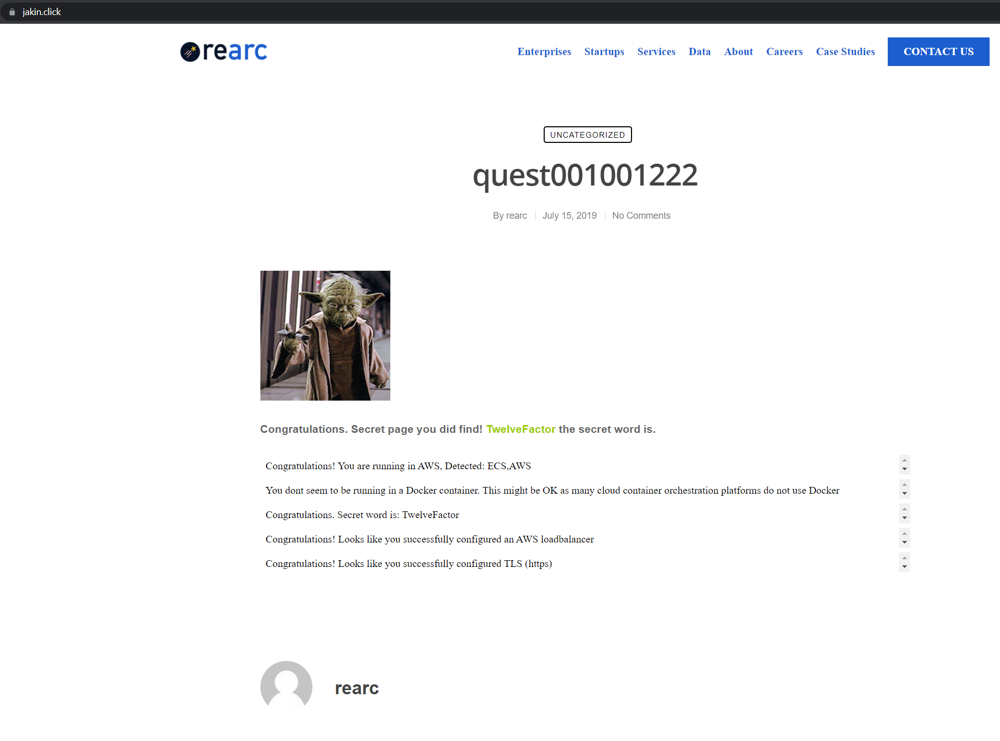

Hello Rearc!
===============

This A-quest-in-the-clouds challenge was a blast! Here are is my submission.

1. Work assets: link to a hosted [git repository](https://github.com/jakinharp/fargate-quest).
2. Proof of completion, as one or both of the following:
 > a. A screenshot: A friendly Yoda appears! 

 
> b. A link to the hosted public cloud deployment: http://jakin.click (redirects to HTTPS)
3. An answer to the prompt: "Given more time, I would improve..."
    1.  I would split different parts of this build into modules. This would make adding new applications under the same account quick, but maintains fine control. And they could be re-used with little effort.

    2. I would build a TF controller node/instance/workspace inside of AWS. This would allow all deploys to be locked down via SGs to require access to node. Also, this would make it so that all TF work was done with the same versions & dependencies, from user-to-user.
    
    3. I would speak with the stakeholders to find out what the metrics for success would be (load times, cost, etc) and what future plans there are for this project (e.g., persistent storage, batch workloads, etc) so that we could plan out changes to meet those requirements.

    4. I would put more time into filling out this README to include a **complete** (and verified) "How to use" section.
    

Readme
=========================

This is a successful solution to deploy the A-quest-in-the-clouds app into AWS. The resources used included:
* Terraform
* Git
* Docker
* VSCode
   
AWS Services:
* Elastic Container Regristry (where private docker image gets saved)
* Elastic Container Service (container orchestration)
* Application Load balancer (w/ HTTP to HTTPS forwarding)
* Auto-scaling targets (scaling policy)
* Cloudwatch log group
* Route53 (zone & record management)
* Amazon Certificate Manager (certification handler for TLS)
* Identity & Access Managment (IAM) (ecs_task_execution_role)

How to use
-----
To deploy this in your own environment, you'll need to:
* setup your AWS profile
* select your domain & URL (which will likely be in variables.tf in a future version)
* run 'terraform fmt && terraform validate && terraform plan'
* if all looks good, run 'terraform apply'

